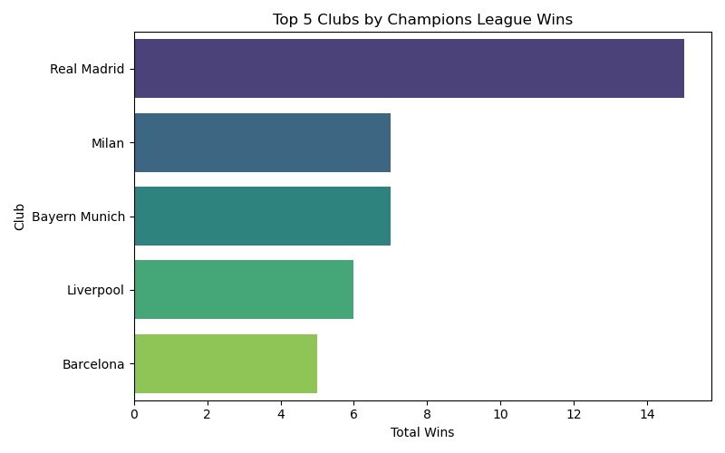
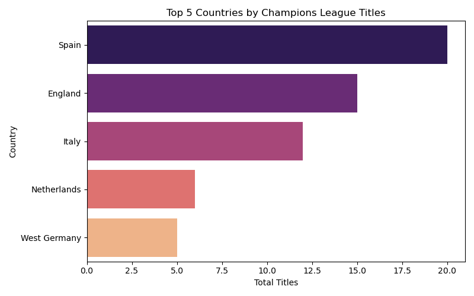
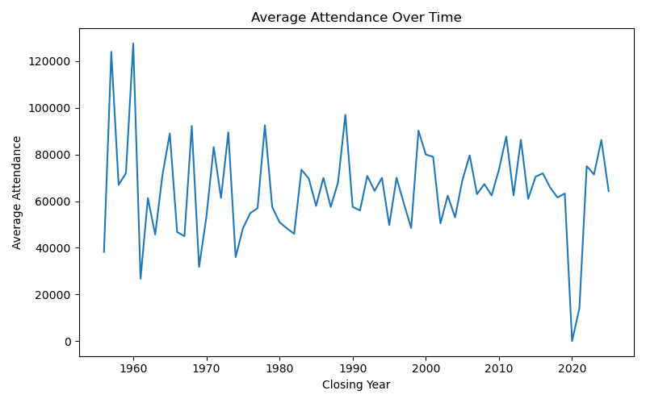
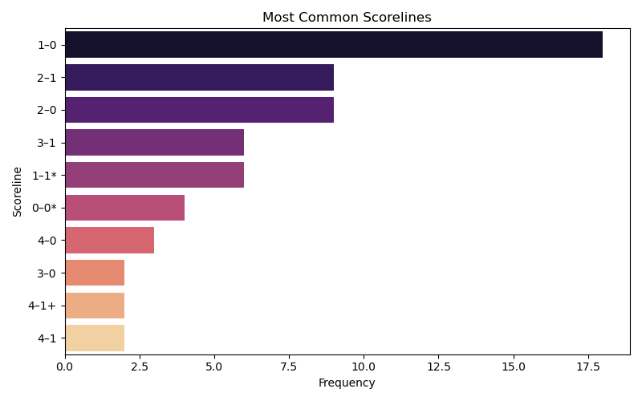
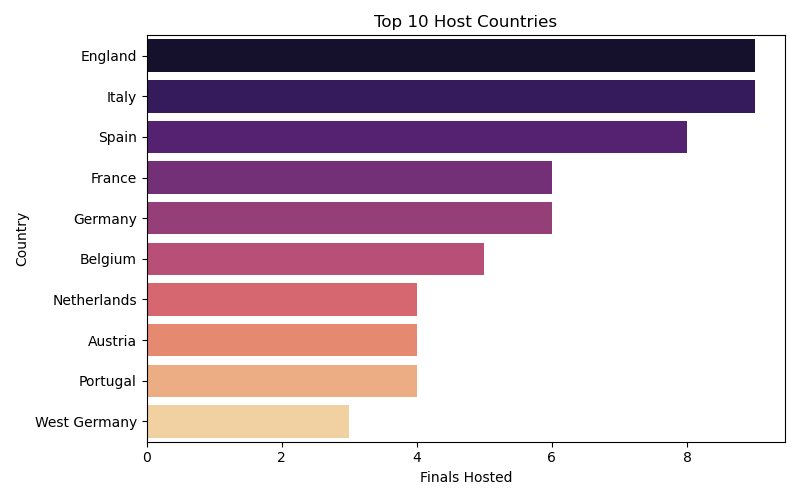
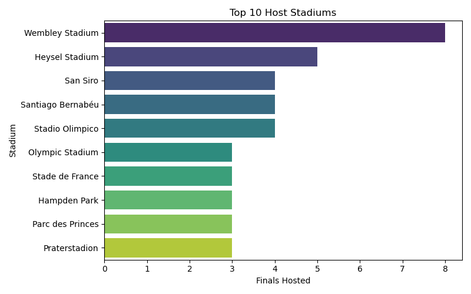
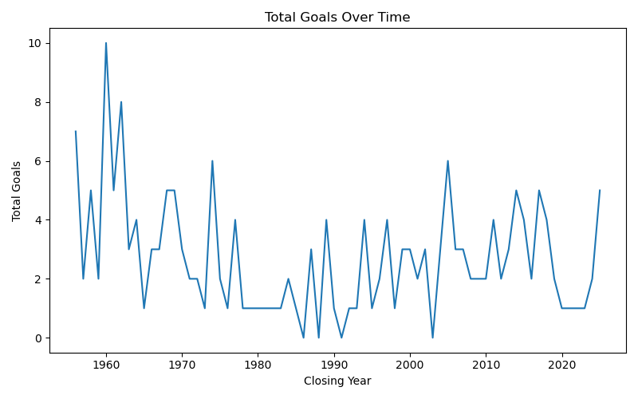
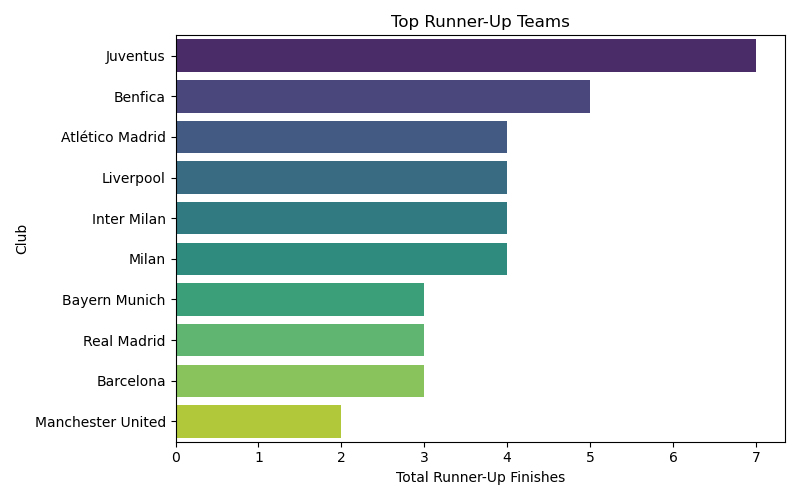
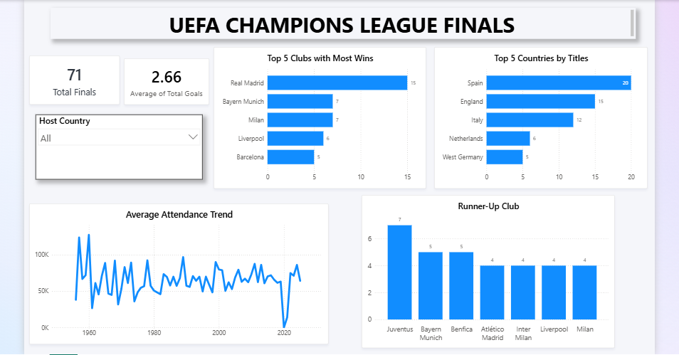

# UEFA Champions League Finals Analysis

# Project Overview
This project analyzes historical UEFA Champions League finals data to uncover insights on team performance, goal trends, attendance patterns, and hosting distribution.
It follows a complete modern data analytics workflow:

Data Cleaning & Transformation (Staging → Warehouse)
Data Modeling (Warehouse Schema)
Data Analysis (Analytics Schema with Views)
Data Visualization (Power BI Dashboard) 

# Objectives
The project answers key analytical questions such as:
- Which clubs and countries dominate the competition?
- How have goals and attendance evolved over time?
- What are the most common match outcomes?
- Which locations host finals most frequently? 

# Tools & Technologies
- **PostgreSQL:** Data cleaning, transformation, and modeling
- **SQL:** Analytical queries and view creation
- **Power BI:** Interactive dashboard
- **Python:** (Pandas, Matplotlib, Seaborn) Data Visualization 

# Data Architecture
This project follows a 3-layer data architecture:
```
staging → warehouse → analytics 
```
### 1. Staging Schema
- Raw data loaded from CSV
- Minimal transformation 
### 2. Warehouse Schema
- Cleaned and structured data

**Key transformations:** 
- Trimmed text fields
- Cleaned score values (* for penalties)

**Extracted:** 
- Closing year 
- Host country

**Created:** 
- Winner score 
- Loser score
- Goal difference
- Total goals 
### 3. Analytics Schema
- Contains views that answer business questions
- Optimized for reporting and visualization
- Each view corresponds to a specific analytical question 

# Analytics Views
Each business question is implemented as a SQL view in the analytics schema.
1. Top Five Clubs with the Most Wins
``` sql
-- Top 5 clubs with the most wins

CREATE VIEW analytics.most_win_clubs AS
SELECT
    winner_team,
    COUNT(*) AS total_win
FROM
    warehouse.ucl_finals
GROUP BY
    winner_team
ORDER BY 
    total_win DESC
LIMIT 5; 
```

Visualized Data
``` python
plt.figure(figsize=(8, 5))
sns.barplot(x='total_win', y='winner_team', data=df, palette='viridis', hue='winner_team')
plt.title('Top 5 Clubs by Champions League Wins')
plt.xlabel('Total Wins')
plt.ylabel('Club')
plt.tight_layout()
plt.savefig('images/01_most_win_clubs.png')
plt.show()
```

Results


Insights
- Real Madrid stands out as the most successful club with 15 UEFA Champions League titles, holding a significant lead over all other teams. Their total is more than double that of many competitors, highlighting their long-term dominance.
- AC Milan and Bayern Munich are tied with 7 titles each, reflecting a closely contested race for second place and a similar level of European success.
- Liverpool FC, with 6 titles, and FC Barcelona, with 5, are separated by just one title, showing how tight the competition is among clubs in this tier.

2. Top Five Nations by Number of Titles
``` sql
-- What is the top 5 nations with number of titles

CREATE VIEW analytics.nations_by_title AS
SELECT 
    winner_country,
    COUNT(*) AS total_title
FROM
    warehouse.ucl_finals
GROUP BY
    winner_country
ORDER BY
    total_title DESC
LIMIT 5;
```

Visualized Data
``` python
plt.figure(figsize=(8, 5))
sns.barplot(x='total_title', y='winner_country', data=df, palette='magma', hue='winner_country')
plt.title('Top 5 Countries by Champions League Titles')
plt.xlabel('Total Titles')
plt.ylabel('Country')
plt.tight_layout()
plt.savefig('images/02_country_by_title.png')
plt.show()
```

Results


Insights
- Spain leads by a wide margin with 20 titles, exceeding second-place England (15) by 33%. This dominance is largely driven by the consistent success of clubs like Real Madrid and FC Barcelona in European competitions.
- Western Europe clearly dominates the landscape, as all top five countries come from this region, with no representation from Eastern Europe among the leading nations.
- West Germany (5 titles) and Netherlands (6 titles) show a close comparison, despite West Germany no longer existing after 1990. This highlights how successful their clubs were within a relatively shorter period.

3. Average Attendance Over Time
``` sql
-- What is the average attendance over time

CREATE VIEW analytics.average_attendance AS
SELECT
    closing_year,
    ROUND(AVG(attendance), 0) AS average_attendance
FROM
    warehouse.ucl_finals
GROUP BY
    closing_year
ORDER BY
    closing_year DESC
```

Visualized Data
``` python
plt.figure(figsize=(8, 5))
sns.lineplot(x='closing_year', y='average_attendance', data=df)
plt.title('Average Attendance Over Time')
plt.xlabel('Closing Year')
plt.ylabel('Average Attendance')
plt.tight_layout()
plt.savefig('images/03_average_attendance_by_season.png')
plt.show()
```

Results


Insights
- The 1950s and 1960s recorded the highest match attendances, often surpassing 100,000 spectators, largely due to the presence of large open stadiums with minimal safety regulations.
- There is a sharp decline around 2020–2021, where attendance fell to nearly zero, mainly as a result of the COVID-19 pandemic, which led to games being played behind closed doors.
- Following 2021, attendance levels rebounded significantly but have not reached the highs seen before 2000. This indicates that modern stadium capacity limits and ticketing systems typically keep attendance within the 70,000–90,000 range.

4. Most Common Scoreline
``` sql
-- What is the most common scoreline

CREATE VIEW analytics.common_scoreline AS
SELECT
    score,
    COUNT(*) AS frequency
FROM
    warehouse.ucl_finals
GROUP BY
    score
ORDER BY
    frequency DESC
LIMIT 10
```

Visualized Data
``` python
plt.figure(figsize=(8, 5))
sns.barplot(x='frequency', y='score', data=df, palette='magma', hue='score')
plt.title('Most Common Scorelines')
plt.xlabel('Frequency')
plt.ylabel('Scoreline')
plt.tight_layout()
plt.savefig('images/04_common_scorelines.png')
plt.show()
```

Results


Insights
- A 1–0 scoreline is the most common outcome in finals, occurring 18 times—almost twice as often as the next most frequent result. This highlights how UEFA Champions League Final games are typically tight and low-scoring.
- Scorelines of 2–1 and 2–0 each appear 9 times, and when combined with 1–0, they make up the majority of final results, reinforcing the trend of closely contested matches.
- Penalty shootout outcomes, such as 1–1* and 0–0*, occur 6 and 4 times respectively, indicating that over 15% of finals are ultimately decided through penalties.

5. Average Goals per Final
``` sql
--What is the average goals per final

CREATE VIEW analytics.final_goals AS
SELECT
    ROUND(AVG(total_goals), 2) AS average_goals
FROM
    warehouse.ucl_finals
```

Visualized Data
``` python
plt.figure(figsize=(4, 4))
plt.text(0.5, 0.5, f"Average Goals in Finals:\n{df['average_goals'].iloc[0]:.2f}",
         fontsize=14, ha='center', va='center', color='black')
plt.axis('off') 
plt.tight_layout()
plt.savefig('images/05_average_goals_in_finals.png')
plt.show()
```

Results


Insights
- An average of 2.66 goals per final is relatively low, indicating that UEFA Champions League Final matches are usually tactically cautious and defensively organized.
- This figure falls slightly below the typical league match average of around 2.7–3.0 goals, further supporting the idea that finals are generally tight and low-scoring.
- When considered alongside the scoreline patterns, it shows that most finals are decided by a narrow one-goal margin, emphasizing how closely contested these games tend to be.

6. Attendance Trend Over Time
``` sql
-- What is the attendance over time

CREATE VIEW analytics.attendance AS
SELECT
    closing_year,
    attendance
FROM
    warehouse.ucl_finals
ORDER BY
    closing_year DESC
```

Visualized Data

It is the same as average attendance chart

Insights
- Attendance hit its all-time high of 120,000–127,000, driven by unrestricted stadium capacities. This was the ceiling the trend never returned to.
- A consistent downward drift from 90,000 plus to approximately 50,000–70,000, driven by stricter safety regulations and the shift to all-seater stadiums.
- Attendance stabilized around 60,000–90,000, collapsed near zero in 2021 due to COVID, then recovered, settling into a permanently lower modern ceiling.

7. Country that Hosted the Most Finals
``` sql
-- Which country has hosted the most finals

CREATE VIEW analytics.host_country AS
SELECT
    host_country,
    COUNT(*) AS total_finals
FROM
    warehouse.ucl_finals
GROUP BY
    host_country
ORDER BY
    total_finals DESC
```

Visualized Data
``` python
plt.figure(figsize=(8, 5))
sns.barplot(x='total_finals', y='host_country', data=df.head(10), palette='magma', hue='host_country')
plt.title('Top 5 Host Countries')
plt.xlabel('Finals Hosted')
plt.ylabel('Country')
plt.tight_layout()
plt.savefig('images/07_host_countries.png')
plt.show()
```

Results


Insights
- England and Italy jointly top the list of host nations with 9 finals each, reflecting their early influence and strong football infrastructure in European competitions.
- Spain follows closely with 8 finals, with iconic venues like the Santiago Bernabéu Stadium contributing to its popularity as a host location for UEFA events.
- Nations such as Belgium (5), Austria (4), and Portugal (4) have also hosted multiple times, highlighting UEFA’s effort to distribute finals across different parts of Europe.

8. Stadium that Hosted the Most Finals
``` sql
-- Which stadium has hosted the most finals

CREATE VIEW analytics.host_stadium AS
SELECT
    venue,
    host_stadium,
    COUNT(*) AS total_finals
FROM
    warehouse.ucl_finals
GROUP BY
    venue,
    host_stadium
ORDER BY
    total_finals DESC
```

Visualized Data
``` python
plt.figure(figsize=(8, 5))
sns.barplot(x='total_finals', y='host_stadium', data=df.head(10), palette='viridis', hue='host_stadium')
plt.title('Top 10 Host Stadiums')
plt.xlabel('Finals Hosted')
plt.ylabel('Stadium')
plt.tight_layout()
plt.savefig('images/08_host_stadiums.png')
plt.show()
```

Results


Insights
- Wembley Stadium stands clearly ahead with 8 finals hosted, nearly twice as many as Heysel Stadium (5), reinforcing its reputation as one of the most iconic venues in European football.
- Heysel Stadium hosting 5 finals is particularly significant given its association with the Heysel Stadium disaster, after which it was no longer used for such events. Its finals were largely concentrated within a specific historical period.
- A group of four stadiums San Siro, Santiago Bernabéu Stadium, Stadio Olimpico, and Olympic Stadium are each tied with 4 finals, highlighting a strong cluster of elite venues.

9. Trend of Total Goals Over Time
``` sql
-- What is the trend of goals over time

CREATE VIEW analytics.goals_over_time AS
SELECT
    closing_year,
    SUM(total_goals) AS total_goals
FROM
    warehouse.ucl_finals
GROUP BY
    closing_year
ORDER BY
    closing_year DESC
```

Visualized Data
``` python
plt.figure(figsize=(8, 5))
sns.lineplot(x='closing_year', y='total_goals', data=df)
plt.title('Total Goals Over Time')
plt.xlabel('Closing Year')
plt.ylabel('Total Goals')
plt.tight_layout()
plt.savefig('images/09_goals_over_time.png')
plt.show()
```

Results


Insights
- The late 1950s and early 1960s saw the most goal-filled finals, with some matches featuring 7–10 goals, sharply contrasting with the lower-scoring modern era.
- From the 1960s onward, there is a clear decline in goals per final, reflecting the rise of more sophisticated defensive tactics and structured gameplay.
- Since 2000, finals rarely exceed 5 goals, with most ending between 2–4 goals, highlighting how top-level defensive coaching has reshaped the character of these matches.

10. Club with the Most Runner-Up Finishes
``` sql
-- Clubs with most runner-up finishes

CREATE VIEW analytics.runner_up AS 
SELECT
    runner_up_team,
    runner_up_country,
    COUNT(*) AS total_runner_up
FROM
    warehouse.ucl_finals
GROUP BY
    runner_up_team,
    runner_up_country
ORDER BY
    total_runner_up DESC
LIMIT 10
```

Visualized Data
``` python
plt.figure(figsize=(8, 5))
sns.barplot(x='total_runner_up', y='runner_up_team', data=df, palette='viridis', hue='runner_up_team')
plt.title('Top Runner-Up Teams')
plt.xlabel('Total Runner-Up Finishes')
plt.ylabel('Club')
plt.tight_layout()
plt.savefig('images/10_runner_up_teams.png')
plt.show()
```

Results


Insights
- Juventus holds the unenviable record of 7 runner-up finishes, the most of any club, underscoring a recurring pattern of near-misses despite strong domestic success.
- Benfica stands out with 5 runner-up finishes without a single win in those finals, making them arguably one of the unluckiest clubs in European football history.
- In contrast, Real Madrid and Bayern Munich have each been runners-up only 3 times, demonstrating their exceptional ability to turn final appearances into victories relative to their impressive title counts.

# Power BI Dashboard
An interactive dashboard was built using the warehouse and analytics layer to visualize key insights.
## Features:
**KPI Cards:**
- Total Finals
- Average Goals per Final

**Team Analysis:** 
- Top Clubs by Wins
- Runner-Up Clubs 
- Country Analysis: Top Countries by Titles 

**Trends:** 
- Goals Over Time
- Attendance Over Time 

**Hosting Insights:** 
- Host Countries 

**Dashboard Preview:**


# Key Insights
- Spain stands out as the most successful nation with 20 titles, while Juventus holds the highest number of runner-up finishes (7) without a comparable number of wins. This highlights the distinction between consistently reaching finals and actually securing titles.
- Champions League finals are typically closely contested and low-scoring, with an average of 2.66 goals per match. The 1–0 scoreline appears most frequently (18 times), and over 15% of finals are decided by penalties, emphasizing how evenly matched the competing teams are.
- Hosting of finals is concentrated in a few countries, with England and Italy leading at 9 finals each. Wembley Stadium alone has hosted 8 finals, nearly twice as many as any other venue, underscoring its importance as a premier football venue.
- Attendance has declined significantly from its peak of 127,000 in the late 1950s and has since stabilized between 60,000 and 90,000 in modern times. Although the sharp drop in 2021 was due to COVID-19, the overall long-term decline has been evident since the 1960s.


# Project Highlights
- End-to-end data analytics workflow
- Structured data architecture (Staging → Warehouse → Analytics)
- Use of SQL views for scalable analysis
- Interactive Power BI dashboard
- Well-documented GitHub project 

# Conclusion
This project demonstrates:
- Data cleaning and transformation
- Data modeling and architecture design
- SQL-based analytical thinking
- Visualization and storytelling